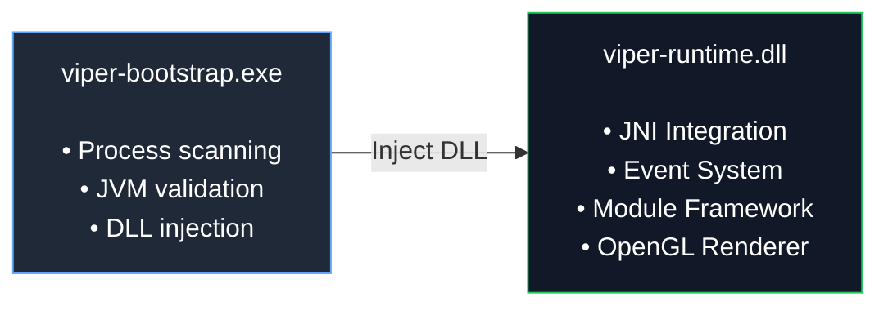
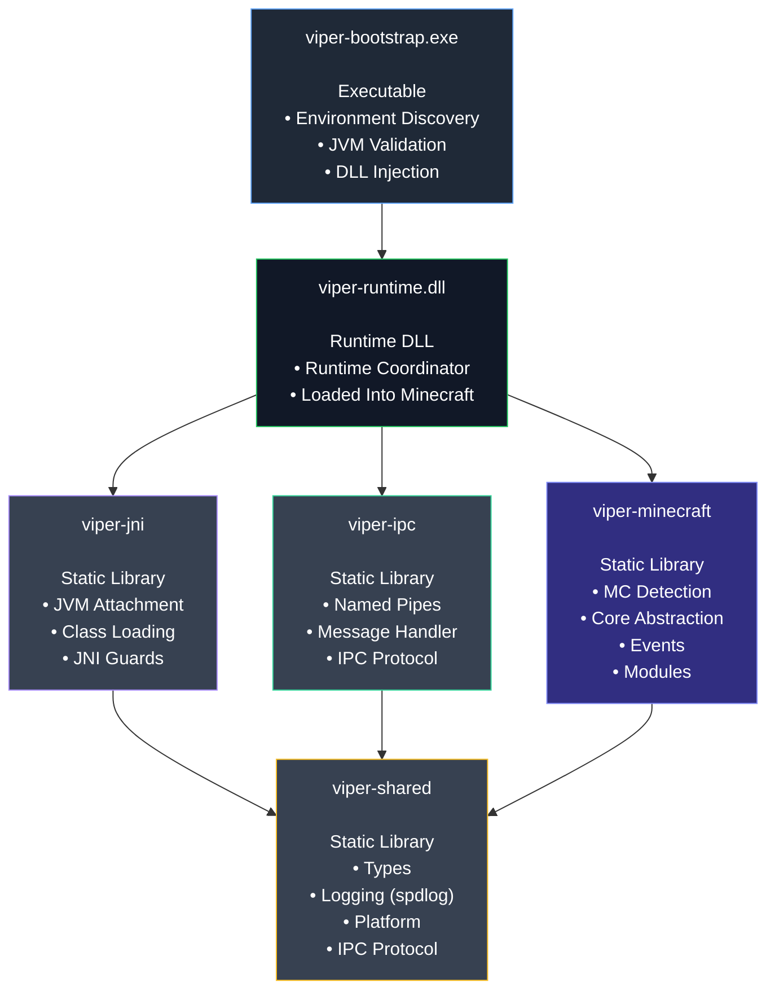

# Viper | Minecraft 1.8.9 Ghost Client Runtime Framework
> A modern, modular C++ injection and runtime framework for Minecraft 1.8.9.


## Overview

Viper is a clean, headless injector engine and foundation designed for Minecraft 1.8.9. 

**Note:** This is *not* a finished, usable gameplay client. It is a "blank slate" developer framework. It provides all the necessary low level scaffolding, including JNI reflection, lock free OpenGL rendering hooks, and binary IPC communication... **so you can focus on building your own custom modules and features without reinventing the wheel.**

## Key Features

- **Multi Environment Support:** Safely resolves Java classes across Vanilla, Forge, and Lunar Client environments.
- **Thread Safe Architecture:** Built with modern C++17, utilizing RAII wrappers, atomic hazard pointers, and a custom thread pool to guarantee a 100% crash free DLL injection and ejection lifecycle.
- **Safe OpenGL Hooks:** Integrates MinHook for `wglSwapBuffers` with strict OpenGL state preservation, enabling you to safely render 2D overlays in game without visual corruption.
- **High Performance IPC:** Implements an asynchronous Named Pipe server for binary framed JSON communication with external controllers.

## Architecture



## Components


## Supported Environments

| Environment | Detection | Class Loading |
|-------------|-----------|---------------|
| Vanilla 1.8.9 | JVM args, main class | `FindClass` |
| Forge 1.8.9 | LaunchWrapper classes | `LaunchClassLoader.findClass` |
| Lunar Client | Lunar bootstrap | Context classloader |

*Note: Lunar Client is supported and compatible. Other custom or unlisted launchers are not guaranteed to work.*

## Build Requirements

- **Windows x64** (Windows 10+)
- **Visual Studio 2022** with C++ Desktop Development workload
- **CMake 3.20+** with Ninja generator
- **Java 8 JDK x64** (Ensure `JAVA_HOME` is set)

## Quick Start

### Build C++ Backend
```powershell
cmake --preset x64-Release
cmake --build --preset x64-Release
```

## Usage Modes

### Auto Mode (Recommended)
```powershell
build\x64-Release\bin\Release\viper-bootstrap.exe
```
Automatically detects a running Minecraft instance and injects the runtime DLL. If none is found, it will log an error and exit.

### Inject Mode
```powershell
viper-bootstrap.exe --inject
viper-bootstrap.exe --inject <PID>
```
Uses standard remote thread injection into an already running Minecraft process.

## IPC Protocol

The framework exposes a Named Pipe (`\\.\pipe\viper-ipc-<PID>`) using binary framed messages for external tool integration:

```text
┌──────────────────────────────────────────┐
│ Header (18 bytes, packed)                │
│  u32 magic     = 0x52504956 ("VIPR")     │
│  u16 version   = 1                       │
│  u16 type      = MessageType enum        │
│  u32 payloadSize                         │
│  u32 sequenceId                          │
│  u16 reserved  = 0                       │
├──────────────────────────────────────────┤
│ Payload (0..65536 bytes)                 │
│  JSON string                             │
└──────────────────────────────────────────┘
```

## License

This project is licensed under the MIT License - see the [LICENSE](LICENSE) file for details.
